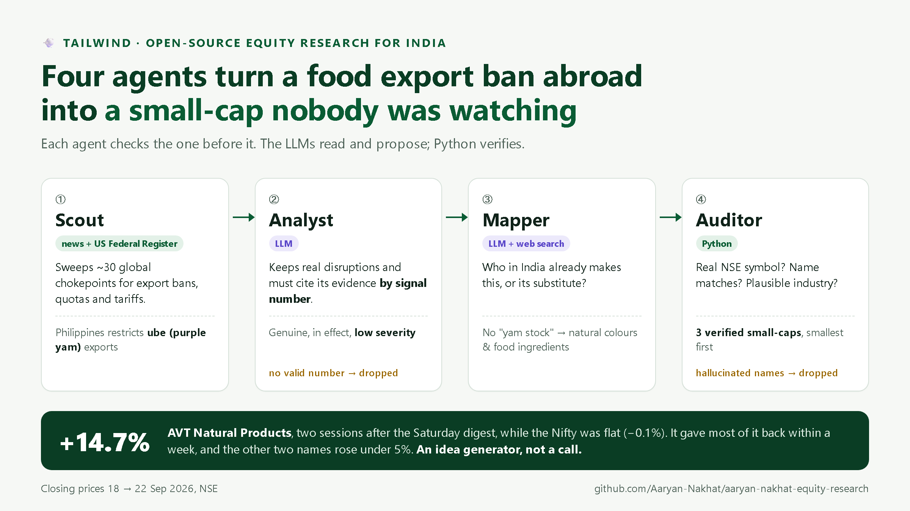
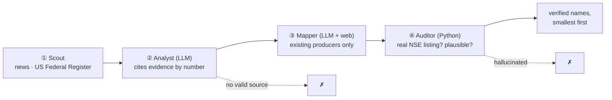

# 📈 aaryan-nakhat-equity-research

> **Type a company name. Get the report an analyst would write** — for Indian stocks (NSE / BSE), self-hosted,
> from primary sources only. Ask in a **local web UI**, your **terminal** or by **email**.


-6E56CF)


[](https://github.com/Aaryan-Nakhat/aaryan-nakhat-equity-research/actions/workflows/ci.yml)

<p align="center"></p>

**[Deep report](#-the-deep-report)** · **[Find ideas](#-find-ideas-you-didnt-ask-for)** ·
**[Global & demand engines](#-agents-that-read-the-world)** · **[Sectors, investors, earnings](#-sectors-investors-and-earnings)** ·
**[Funds, IPOs, levels, alerts](#-funds-ipos-levels-and-alerts)** · **[How it thinks](#-how-it-thinks)** ·
**[Quickstart](#-quickstart)** · **[Every command](docs/COMMANDS.md)**

## Why it's different

- **Every number is computed, not generated.** Financials come straight from exchange XBRL filings; ratios,
  forensics, valuation and technicals are deterministic Python. The LLM reads filings and writes the argument —
  it never supplies a figure. With no LLM configured at all, every report still builds with every number.
- **Primary sources only** — NSE / BSE, SEBI, RBI, AMFI, PIB, company filings. No blogs, aggregators or data vendors.
- **Shaped to the business** — a bank is read on NIM, NPAs and capital; an insurer on combined ratio, persistency
  and solvency; everyone else on the industrial statements. Not one template with "n/a" everywhere.
- **It finds ideas, not just analyses them** — 12 screeners, a hotlist of names several screens agree on, agent
  pipelines that turn a foreign export ban or a demand surge into verified Indian beneficiaries, and a
  management-says vs numbers-show read of every earnings call.
- **Yours** — runs on your machine, any LLM provider (or none), MIT-licensed.

## 🔬 The deep report

Ask for any listed company in plain words (`adani power`, `hdfc` → pick from a list, `INFY`). A few minutes later:
a report of ~15 sections plus a PDF with charts. **[Full Adani Power PDF](docs/samples/adani-power.pdf)** ·
[HDFC Bank](docs/samples/hdfc-bank.pdf) · [ICICI Lombard](docs/samples/icici-lombard.pdf) — unedited output of 29-Sep-2026.

**It starts from the company's own filings** — what the business does, its revenue mix, market position — read
from the annual report, investor presentations and concall transcripts, with the page it came from.


**Forensics** — Altman Z (distress), Beneish M (earnings manipulation), Piotroski F (fundamental strength),
accruals and promoter pledge, each with what the number means.


**Who owns it, and who just moved** — every promoter and >1% holder from the SEBI shareholding filings, and the
quarter-on-quarter diff: who entered, added, trimmed or exited.


**💰 Smart-money cost** — what each institution likely paid (from the price range of the quarters it bought in),
so you can see who's sitting on gains and might book profit. Holders who bought before the data starts are
marked unknown, not guessed.


**🏢 The inside view** — what employees say about the company and its management, graded A→E against its own
industry.


**What the price already assumes** — a reverse-DCF (the growth today's price implies), a Monte-Carlo DCF, and
the multiple against the company's own history and its peers.


**The verdict, argued** — earnings quality, returns, balance sheet, growth, forensics and valuation, each read by
the LLM from the computed brief and the filings, ending in a verdict it has to justify.


**Trading levels** — support and resistance zones computed from swing pivots, moving averages, 52-week extremes,
volume-by-price and round numbers, and a reward-to-risk entry / stop / target that defers to the fundamental verdict.


<details>
<summary><b>Banks and insurers get their own report</b> — NIM, NPAs, CET1 · combined ratio, solvency, persistency</summary>

A lender has no EBITDA and an insurer has no working capital, so they're read on the numbers that matter for them,
with their own health checks — and the industrial forensics (Altman, Beneish, Piotroski) are left out rather than
misapplied.


</details>

Reply **`1`** after any report for the **Upside Drivers 1-pager**: forward catalysts from the concalls and investor
presentations, each with an estimated ₹ cr / % impact and how certain it is.

## 🔎 Find ideas you didn't ask for

Every screen replies with a ranked, numbered list — pick a number for that company's deep report.

**🔥 `hotlist`** — the names that several screens flag at once (volume breakouts, market beaters, institutional
buying, value + clean books, small-cap capex). Agreement between independent screens is a stronger lead than any one.


**`screen: value`** — the Nifty 500 ranked on quality (Piotroski) + clean forensics (Altman, Beneish, accruals, no pledge)
+ cheap against its own history.


**`screen: smallcap`** — ₹1,000–10,000 cr companies in a capex cycle (capex vs its 3-year base and depreciation,
self-funded, rising ROCE, smart money in), with distress, manipulation, pledge and shrinking-revenue traps gated out.


<details>
<summary><b>9 more screens</b> — volume breakouts · market beaters · institutional buying · margin momentum · debt payers · compounders · holdcos below NAV · marquee investors · chart setups</summary>

**`screen: volume`** — near a 52-week high, in an uptrend, on a volume surge.


**`screen: beaters`** — beating the Nifty 500 over 3, 6 and 12 months and still trending.


**`screen: institutions`** — promoters raising their own stake, with the institution adding alongside.


**`screen: margins`** — net margin expanding on growing revenue.


**`screen: deleverage`** — cut debt over 3–4 years while staying profitable.


**`screen: quality`** — high ROCE, low debt, steady growth, clean books.


**`screen: holdco`** — listed holding companies trading below the value of their listed stakes.


**`screen: investors`** — where ~25 tracked marquee investors entered, added, trimmed or exited.


**`screen: technical`** — the strongest chart setups, each with entry, stop and target.


</details>

## 🌍 Agents that read the world

**💨 `tailwind`** — when a country restricts exports of something (a ban, a quota, a tariff), buyers need another
supplier. Four agents find the Indian listed companies that *are* that supplier: a scout reads ~30 commodity
chokepoints in the news and the US Federal Register, an analyst keeps only real disruptions (citing its evidence by
number), a web-search mapper finds existing producers, and a Python auditor drops any name that isn't a real,
plausible NSE listing. Pushed weekly, plus same-day alerts when a fresh shock lands.


**⛏️ `pickaxe`** — the demand-side mirror: rising "buy" searches on Google Trends and demand news → the durable theme →
not the crowded producer but the supplier to it (the feed, vaccine, packaging or equipment maker), each with its
price, P/E vs sector, support/resistance and a revenue-share projection read from its filings, with sources.


**🏛️ `policy`** — the latest government press releases (PIB), often at the cabinet-approval or draft stage, mapped
to the sectors and listed companies they help.

## 🧭 Sectors, investors and earnings

**`sector: defence`** (or pharma, banks, IT…) — the sector index's trend, relative strength and valuation against its
own history, who's accumulating, and the best and cheapest names inside it, plus its listed supply chain.


**`sector: rotation`** — every sector ranked: leaders, laggards, and the ones turning up from cheap.


**🎙️ `concalls`** — every recent earnings call scored twice: the **tone** of what management said (from the
transcript) and the **execution** in the quarter's numbers (from the filings). Upbeat talk on soft numbers is a
caution; quiet talk on strong numbers is an under-the-radar lead.


**📈 `results`** — companies that just reported, ranked by growth, whether it's accelerating, and margin inflection
(during results season; it's empty between seasons).

**👤 `investor: <name>`** — a marquee investor's disclosed holdings, last-quarter moves and their cost vs today.


**🔗 `suppliers: <company>`** — the smaller listed suppliers feeding a big name.


## 💵 Funds, IPOs, levels and alerts

**`fund: <name>`** — any of ~14,000 mutual-fund schemes: returns, rolling consistency, risk, SIP/XIRR, alpha / beta /
capture vs its benchmark, category rank and, where the AMC publishes it, the portfolio.


**`ipo: ongoing` / `ipo: upcoming` / `ipo: <name>`** — a pre-listing note from the offer documents: fresh issue vs
offer-for-sale, valuation at the band vs listed peers, an accounting and governance flag, risks, subscription, and
apply / avoid / neutral.


**`levels: <name>`** — the quick one: support/resistance zones, structure and a setup with a chart, in ~30 seconds and
without the LLM.


**🔔 `alert: order win`** — watch every company's exchange filings for a phrase and get an email within ~20 minutes of
a match. **💰 `booking` / `sell`** rank your own holdings by profit-booking risk and which to trim first.
**📬 Arrives by itself** (with email set up): a pre-market brief at 08:30 (GIFT Nifty implied open, overnight
markets, FII positioning), midday and evening watchlist digests, and weekly screen, sector, Tailwind, concall and
results pushes.

## 🧠 How it thinks

<p align="center"></p>

The LLMs read, triage and write; **Python computes every number and checks every name they propose.**



**A real case, including the part that didn't work.** On Saturday 19-Sep-2026 the weekly Tailwind digest carried a
low-severity catalyst: the Philippines restricting exports of ube (purple yam). There's no "purple-yam stock", so the
mapper went one layer out, to natural colours and food ingredients, and three small-caps passed the auditor.

| From Friday 18-Sep's close | Tue 22 | Mon 28 |
|---|---:|---:|
| AVT Natural Products | **+14.7%** | +1.1% |
| Vidhi Specialty Food Ingredients | +4.5% | +2.7% |
| Dynemic Products | +0.7% | −2.3% |
| *Nifty 50* | *−0.1%* | *−2.4%* |

One of three ran and gave most of it back within a week — an idea generator, not a call. And the alert came late:
the mid-week check only fired for high-severity shocks, so this waited for Saturday. It now runs three times each
trading day and also breaks in for a fresh shock of any severity with a small- or mid-cap beneficiary.

**→ [How it thinks, in full](docs/HOW_IT_THINKS.md)** — the deep-report flow, the Tailwind and Pickaxe pipelines,
and the one-process architecture, as diagrams.

## 🚀 Quickstart

```bash
git clone https://github.com/Aaryan-Nakhat/aaryan-nakhat-equity-research && cd aaryan-nakhat-equity-research
uv sync && uv run playwright install chromium     # Python 3.12 via uv; Chromium renders the PDFs
cp .env.example .env                              # optional: add an LLM key for the AI write-ups
uv run eqr demo                                   # ≈12 min, one time: fetch a starter set, open the web UI
```

`eqr demo` downloads ~13 months of prices and the financials of a dozen well-known companies **on your
machine** (it asks once before using NSE's site — see [Data sources & terms](#data-sources--terms)), then
opens **http://localhost:8765**. `eqr doctor` shows what's working and the one-line fix for what isn't.
No LLM key yet? Every report still builds with all its numbers; the AI write-up is what the key adds.

**Docker** instead: `cp .env.example .env && docker compose up -d` (web UI on http://localhost:8765), then once
`docker compose run --rm eqr eqr demo --yes --no-serve` (≈12 min) for the starter set. Data lives in a volume.

**On a VPS** (Openship, Coolify, Railway, a plain server): deploy the `Dockerfile`, mount a volume at
`/data`, and **set `WEB_PASSWORD`** — the server refuses to listen publicly without one, so strangers
can't run reports on your LLM key.

**Three ways to ask, one flow.** The browser UI has autocomplete for every command, live progress, reports with
their charts and PDFs, and a history. In a terminal it's `eqr <anything>` (`eqr pick 2` answers a list). By email,
the command is the subject line. **[Every command →](docs/COMMANDS.md)**

```bash
eqr adani power              # deep report in the terminal (saved as Markdown + HTML + PDF)
eqr hdfc                     # several matches → numbered list
eqr pick 1                   # pick one
eqr screen: value --open     # any command; --open opens the HTML
```

## How it works

Primary data → DuckDB → deterministic analysis + signals → an LLM writes the thesis → web UI / terminal / email.
**Full detail per area in [`docs/`](docs/)** ([`METHODOLOGY.md`](docs/METHODOLOGY.md) traces every metric
source → formula → model).

### 📥 Data — primary / official only (`scrapers/`)

- **Market** — prices, **delivery %**, F&O + participant OI, index closes (with PE/PB per index) from
  NSE archives (plain HTTP); **live intraday quotes** via NSE NextApi.
- **Filings & ownership** — financials (XBRL; ~6y P&L, balance-sheet + cash-flow from FY23), corporate
  actions, announcements, **holder-level shareholding** (every promoter + public >1% holder from the SHP
  XBRL), **insider / promoter (SEBI PIT)** trades, promoter pledge.
- **Macro & funds** — **USD/INR** (FBIL) · near-month **gold / silver / crude** futures (MCX) ·
  **mutual-fund NAVs** (AMFI, ~14.5k schemes) · **PIB** government-policy releases.
- Anti-bot `/api/*` solved with `scrapling` (Camoufox browser tier); everything else is plain HTTP.

### 🧮 Analysis — deterministic Python (`analysis/`)

- **Fundamental** — multi-year income statement / balance sheet / cash flow, the full ratio set,
  FCFF/FCFE, **CFO-quality** (CFO vs PAT), growth & margin trends.
- **Forensic** — Piotroski F (0–9), **Altman Z**, **Beneish M**, accruals, pledge — plus statistical
  forensics (Benford / Sloan).
- **Valuation, sector-appropriate** — P/B-on-ROE for financials, EV/EBITDA + mid-cycle for cyclicals,
  P/E elsewhere; the current multiple as an **own-history percentile** (cheap/rich vs itself);
  **reverse-DCF + Monte-Carlo DCF** as the centrepiece; a **forward multiple** from management guidance.
- **Technical** — trend / momentum (SMA · RSI · MACD · BB · ATR), **delivery-% conviction**, 52-wk
  position, relative strength vs Nifty; computed support/resistance **zones** (swing pivots + MAs + 52-wk
  extremes + volume-by-price + round numbers) → a **reward:risk entry / stop / target** that defers to the
  fundamental verdict.

### 📡 Signals

- **FII F&O positioning** — net-long % in index futures vs retail (a smart-money sentiment read).
- **Insider / promoter (SEBI PIT)** trades · **promoter pledge** changes · **bulk / block deals** (each
  counterparty classified: listed co / MF / FPI / individual…).
- **💰 Smart-money cost zones** — each institution's *inferred* cost from the price range of the quarters
  it added in (~4y of SHP) vs the current price → a **profit-booking-risk** read; positions built before
  our earliest snapshot are honestly marked *cost-unknown*, not guessed.

### 🔎 Discovery

Screeners (`screen: …`), the 🔥 hotlist, sector analysis, 💨 Tailwind and ⛏️ Pickaxe (four-tier agent
pipelines: scout → analyst → web-grounded mapper → auditor against the NSE master), 🎙️ Concalls,
📈 Results Radar, 🔔 announcement alerts, mutual funds and IPOs — **each explained in
[docs/COMMANDS.md](docs/COMMANDS.md#-the-discovery-engines-in-detail)**.

### 📤 Reports & delivery

- **Deep report** — the LLM reads the quant brief + filing PDFs → a **forensic thesis + verdict**, inline
  **and as a styled PDF**. It leads with a **filing-grounded business overview** (what it does, segment
  revenue-mix %, market cap / TAM / penetration, order book for order-driven names), carries a
  **holder-level shareholding** section + a **quarter-over-quarter ownership diff** (who entered / added /
  trimmed / exited) and the **💰 smart-money cost & profit-booking-risk** block, and gives every
  valuation / forensic / technical section a plain-English **"how to read this."** **Banks get a
  bank-shaped report** — NII, NIM, cost-to-income, credit cost, gross/net NPAs & provision coverage,
  CET1, CD ratio and ✅/⚠️ bank health checks in place of the industrial statements and Altman /
  Piotroski / Beneish (which don't apply to lenders); **insurers get an insurer report** — premiums &
  APE, persistency, claims / combined ratio, underwriting vs investment profit, solvency. Opt-in **Upside Drivers 1-pager** (reply `1`) —
  forward catalysts, each with an estimated **₹cr / % impact**.
- **Pushed digests** — **pre-market** (08:30: GIFT Nifty implied open · overnight US/Asia · India VIX ·
  FII futures · headlines · an LLM overnight read), **full watchlist** (18:00: market-context header ·
  movers · events with **inline filing analysis** · insider trades), **midday** (12:30, same sections on
  live data), the **weekly** screener-movements / sector-rotation / **💨 Tailwind** (Sat), the **monthly**
  **⛏️ Pickaxe** (1st Sat) + **urgent** Tailwind break-ins (pre-market / midday / evening) when a fresh shock lands.
- **Delivery** — the **`eqr` terminal CLI** (saves Markdown + HTML + PDF locally) or **email**; both
  run the same command handler, so name resolution, numbered menus and follow-ups behave identically.
  **`help`** returns the whole command menu; the email bot **auto-tidies its own mailbox** (bins processed workbench mail ~30 min after sending — personal
  mail untouched).
- **LLM** (your configured provider) is used **only** for synthesis / filing-reading / name-resolution — every
  number above is **deterministic**.

## Status

Working end-to-end (NSE/BSE/MCX/FBIL → DuckDB → fundamentals/forensics/technicals/
valuation + signals → LLM report → email bot, always-on). On-demand
reports from the terminal (`eqr`) or email, + a pre-market (08:30), midday (12:30) and full (18:00)
watchlist digest over email. Docs:

- [`docs/COMMANDS.md`](docs/COMMANDS.md) — every command, with details.
- [`docs/HOW_IT_THINKS.md`](docs/HOW_IT_THINKS.md) — the agent pipelines and request flow as diagrams, plus a real case.
- [`docs/METHODOLOGY.md`](docs/METHODOLOGY.md) — **every metric traced source → transform → formula → model** (the "how are you getting this?" reference).
- [`docs/ARCHITECTURE.md`](docs/ARCHITECTURE.md) — end-to-end diagram + component map.
- [`docs/PLAN.md`](docs/PLAN.md) — vision, scope, phase status.
- [`docs/DATA_SOURCES.md`](docs/DATA_SOURCES.md) / [`docs/SCRAPING.md`](docs/SCRAPING.md) — sources + scrapability findings.
- [`docs/FUNDAMENTALS.md`](docs/FUNDAMENTALS.md) — financials data path, ratios, forensic scores, valuation.
- [`docs/TECHNICAL.md`](docs/TECHNICAL.md) — indicators. [`docs/REPORTS.md`](docs/REPORTS.md) — LLM synthesis, PDF, email.
- [`docs/ALERTS.md`](docs/ALERTS.md) — watchlist alerts + the full push schedule.

## Layout

```
src/equity_research/
  scrapers/    source-specific scrapers (NSE, BSE, SEBI, RBI, ...)
  analysis/    fundamental + technical analysis
  reports/     report generation + email delivery
  bot/         the command handler (app.py) + the local channel (local.py) shared by email and CLI
  web/         the local web UI (FastAPI + plain JS, no build step)
  cli.py       the `eqr` terminal command
  common/      config, storage, shared utilities
scripts/       pipeline entry points (email_bot.py launches bot/app.py; make_demo_gif.py / make_samples.py /
               render_card.py rebuild the README media)
data/          raw scrapes + processed artifacts (gitignored)
docs/          reference docs · docs/samples/ real sample reports (specs.txt rebuilds them) · docs/media/ the demo GIF
tests/         tests
```

## Stack

- Python 3.12, `uv`
- `scrapling` (scraping, incl. Camoufox browser tier for NSE's anti-bot `/api/`)
- DuckDB (analytics) · pandas
- the LLM (configured via .env — any provider) — symbol resolution + report synthesis
  Playwright Chromium + `markdown` (HTML → PDF) · SMTP email

## Setup

```bash
uv sync                                   # install deps (Python 3.12)
uv run playwright install chromium        # for HTML → PDF
cp .env.example .env                       # then fill in your own credentials
```

Configure `.env` (all secrets are read from the environment; `.env` is gitignored — see
[`.env.example`](.env.example) for every variable):
- **LLM** *(optional to start — without one every report still builds with all its numbers; the
  AI write-up and the discovery engines like Tailwind / Pickaxe need it)* — bring your own: set `LLM_MODEL` (the provider is inferred from it) and `LLM_API_KEY`
  (or `LLM_BASE_URL` for a custom endpoint). Runs on any provider via [LiteLLM](https://docs.litellm.ai).
- **Email delivery** *(optional — skip it if you only use `eqr` in the terminal)* — one Gmail for
  both sending and reading requests (SMTP/IMAP app password), plus `EMAIL_ALLOWED_SENDERS` (who may
  request reports) and `REPORT_TO` (where pushes go).
- **Schedule, toggles & tuning** — every delivery time, the weekly-push day, per-feature on/off
  switches, the timezone, cache TTLs, timeouts and analytical thresholds are read from `.env` by
  [`src/equity_research/config.py`](src/equity_research/config.py) — **all optional, each defaulting
  to the built-in behaviour**, so nothing here is required to get started. `.env.example` documents
  them in two tiers (headline vs advanced). E.g. `TAILWIND_URGENT_SLOTS=` disables urgent alerts;
  `ENABLE_PICKAXE=false` skips that push.

Bootstrap the local data store, then run a report or the bot:

```bash
uv run python scripts/populate_watchlist.py               # seed the watchlist
uv run python scripts/backfill_eod.py                     # ingest market EOD history
uv run eqr reliance                                       # a deep report in the terminal
uv run eqr doctor                                         # what works here, and the one-line fix for what doesn't
uv run eqr serve                                          # web UI at http://localhost:8765 (+ the email bot if configured)
uv run eqr bot                                            # the always-on email bot — it also serves the web UI
```

**One process owns the database.** DuckDB allows one writing process at a time, so the server
(`eqr serve`, or the email bot) runs everything — the web UI, the email loop and CLI jobs — and a
`eqr` command sent while it's running is forwarded to it (`--direct` forces a local run). The web
server binds to localhost only (`WEB_HOST` / `WEB_PORT`; `WEB_UI_ENABLED=false` turns it off). Set
`WEB_PASSWORD` to require a sign-in — the server refuses to listen beyond localhost without one, so an
instance on a VPS can't be used by strangers to run reports on your LLM key.

The DuckDB file and all scrapes under `data/` are built locally and gitignored — bring your
own data store.

**Tests.** `uv sync --extra dev && uv run pytest` — ~140 tests, no network, no `.env`, no data needed
(every fetch is mocked, every database is a throw-away). They include the forensic scores, valuation and
smart-money cost zones checked against hand-worked numbers, split/bonus/rights/demerger price adjustment,
bank and insurer taxonomies, name resolution and the web UI. [CI](.github/workflows/ci.yml) runs lint and the
suite on Linux and Windows for every push.

## Data sources & terms

This tool ships **no data** — it fetches from public sources **on your own machine** when you
run it, under **their** terms. Several (the exchanges especially) restrict automated access and
**prohibit redistribution**. Please review **[SOURCES.md](SOURCES.md)** before running: it lists
every source, its terms, attribution, and the **NSE browser-tier opt-in** (`NSE_SCRAPING_ENABLED`,
off by default). Intended for **personal, self-hosted, non-commercial** use — don't run it as a
hosted service that scrapes exchanges for others, and don't redistribute fetched data.

## Disclaimer

Personal research tooling, **not investment advice**. It reads only primary/official sources
and can still be wrong; verify anything before you act on it. No warranty — see the license.
Every emailed report and PDF carries the same disclaimer (`REPORT_DISCLAIMER`).

## License

[MIT](LICENSE) © Aaryan Nakhat.
