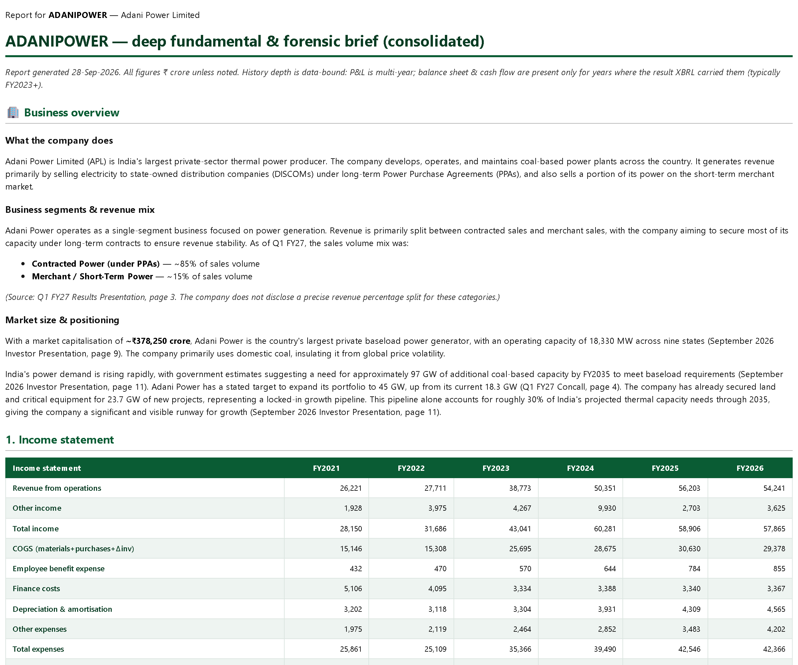
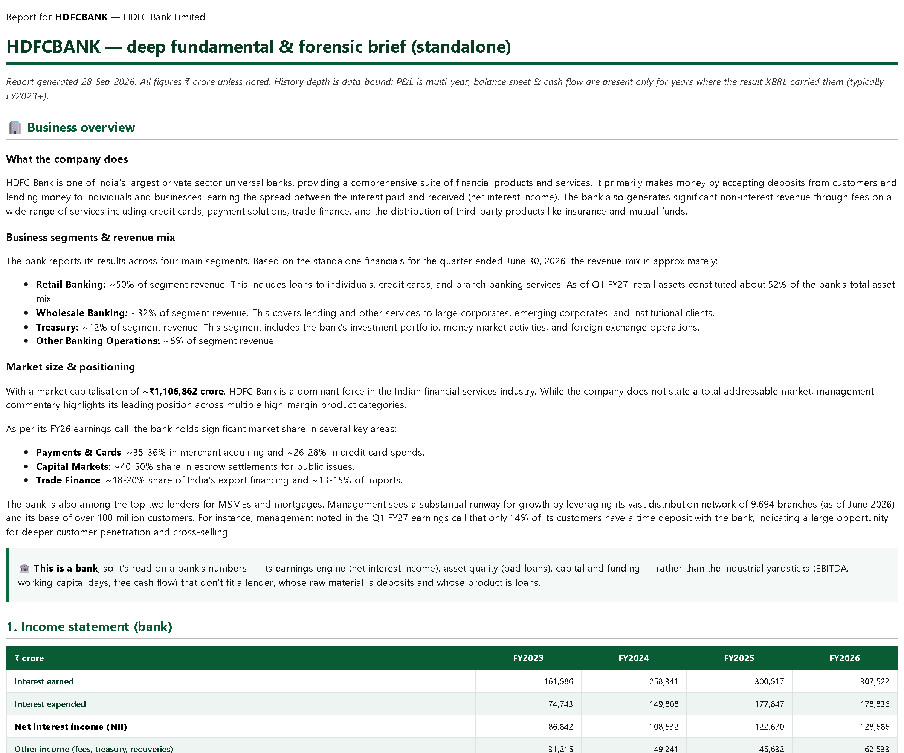
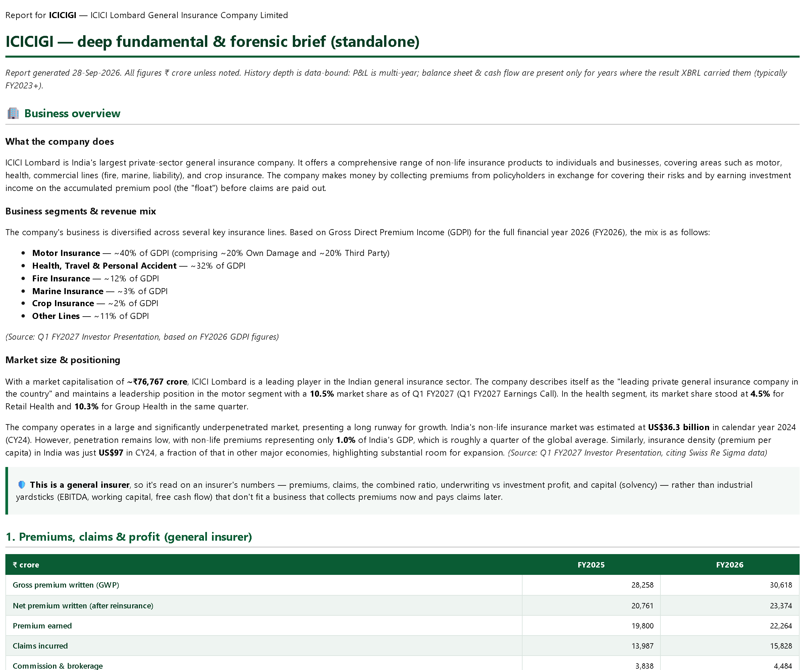

# 📈 aaryan-nakhat-equity-research

> **Type a company name. Get the report an analyst would write** — for Indian stocks (NSE / BSE),
> self-hosted, from primary sources only. Ask in a **local web UI**, your **terminal** or by **email**.


-6E56CF)


<p align="center"></p>

## 📄 Real reports it wrote

Unedited output from 28-Sep-2026 — click a picture for the full PDF. *(Samples, not investment advice.)*

| ⚡ Adani Power — deep report | 🏦 HDFC Bank — a bank, read as a bank | 🛡️ ICICI Lombard — an insurer |
|:---:|:---:|:---:|
| [](docs/samples/adani-power.pdf) | [](docs/samples/hdfc-bank.pdf) | [](docs/samples/icici-lombard.pdf) |
| **💨 Tailwind** — global shocks → Indian beneficiaries | **🔥 Hotlist** — names several screens agree on | **🔄 Sector rotation** — every sector ranked |
| [](docs/samples/tailwind.png) | [](docs/samples/hotlist.png) | [](docs/samples/sector-rotation.png) |

## Why it's different

- **Every number is computed, not generated.** Financials come straight from exchange XBRL filings;
  ratios, forensics (Altman / Beneish / Piotroski), valuation (reverse-DCF, own-history percentiles) and
  technicals are deterministic Python. The LLM only reads filings and writes the thesis.
- **Primary sources only** — exchanges, SEBI, RBI, MOSPI, company filings. No blogs, aggregators or data vendors.
- **Shaped to the business** — banks get NIM / NPAs / CET1, insurers get APE / persistency / combined ratio /
  solvency, everyone else the industrial statements. Not one template with n/a everywhere.
- **It finds ideas, not just analyses them** — screeners, a 🔥 hotlist of names several screens agree on,
  💨 **Tailwind** (a global export ban → the Indian companies that benefit, via a four-agent pipeline),
  ⛏️ **Pickaxe** (surging demand → who sells the shovels), 🎙️ earnings-call **say-do gap**, sector rotation.
- **Yours** — runs on your machine, any LLM (or none: every number still builds), MIT.

## 🚀 Quickstart

```bash
git clone https://github.com/Aaryan-Nakhat/aaryan-nakhat-equity-research && cd aaryan-nakhat-equity-research
uv sync && uv run playwright install chromium     # Python 3.12 via uv; Chromium renders the PDFs
cp .env.example .env                              # optional: add an LLM key for the AI write-ups
uv run eqr demo                                   # ≈12 min, one time: fetch a starter set, open the web UI
```

`eqr demo` downloads ~13 months of prices and the financials of a dozen well-known companies **on your
machine** (it asks once before using NSE's site — see [Data sources & terms](#data-sources--terms)), then
opens **http://localhost:8765**. `eqr doctor` shows what's working and the one-line fix for what isn't.
No LLM key yet? Every report still builds with all its numbers; the AI write-up is what the key adds.

**Docker** instead: `cp .env.example .env && docker compose up -d` (web UI on http://localhost:8765), then once
`docker compose run --rm eqr eqr demo --yes --no-serve` (≈12 min) for the starter set. Data lives in a volume.

**On a VPS** (Openship, Coolify, Railway, a plain server): deploy the `Dockerfile`, mount a volume at
`/data`, and **set `WEB_PASSWORD`** — the server refuses to listen publicly without one, so strangers
can't run reports on your LLM key.

## 📖 What you can ask

Plain words work — `adani power`, `hdfc` (→ a numbered list to pick from), `fund: parag parikh flexi cap`.
The same commands work in the browser, as `eqr <command>` in a terminal, or as an email subject.

| Ask | You get |
|---|---|
| `infosys` *(any company or NSE symbol)* | The **deep report** — business overview, fundamentals, forensics, valuation, technicals, shareholding + smart-money cost, employee sentiment — with a PDF |
| `screen: value` · `quality` · `volume` · `beaters` · `institutions` · `smallcap` · `holdco` … | **Idea screeners** — a ranked, numbered list; pick one for its deep report |
| `hotlist` | 🔥 Names several screeners flag at once |
| `tailwind` · `pickaxe` | 💨 Global supply shocks / ⛏️ demand surges → verified Indian beneficiaries |
| `sector: defence` · `sector: rotation` | 🧭 A top-down sector read / every sector ranked |
| `concalls` · `results` | 🎙️ Management tone vs delivered numbers / 📈 the strongest fresh results |
| `fund: <name>` · `ipo: upcoming` · `levels: <name>` | 💵 Mutual-fund report / 🟢 IPO note / 📈 entry-stop-target |
| `alert: order win` | 🔔 An alert whenever any company files an announcement matching the phrase |

**→ [Every command, with details](docs/COMMANDS.md)** · digests also arrive by themselves (pre-market 08:30,
midday, evening, weekly screens) if you set up email.

```bash
eqr adani power              # deep report in the terminal (saved as Markdown + HTML + PDF)
eqr hdfc                     # several matches → numbered list
eqr pick 1                   # pick one
eqr screen: value --open     # any command; --open opens the HTML
```

## How it works

Primary data → DuckDB → deterministic analysis + signals → an LLM writes the thesis → web UI / terminal / email.
**Full detail per area in [`docs/`](docs/)** ([`METHODOLOGY.md`](docs/METHODOLOGY.md) traces every metric
source → formula → model).

### 📥 Data — primary / official only (`scrapers/`)

- **Market** — prices, **delivery %**, F&O + participant OI, index closes (with PE/PB per index) from
  NSE archives (plain HTTP); **live intraday quotes** via NSE NextApi.
- **Filings & ownership** — financials (XBRL; ~6y P&L, balance-sheet + cash-flow from FY23), corporate
  actions, announcements, **holder-level shareholding** (every promoter + public >1% holder from the SHP
  XBRL), **insider / promoter (SEBI PIT)** trades, promoter pledge.
- **Macro & funds** — **USD/INR** (FBIL) · near-month **gold / silver / crude** futures (MCX) ·
  **mutual-fund NAVs** (AMFI, ~14.5k schemes) · **PIB** government-policy releases.
- Anti-bot `/api/*` solved with `scrapling` (Camoufox browser tier); everything else is plain HTTP.

### 🧮 Analysis — deterministic Python (`analysis/`)

- **Fundamental** — multi-year income statement / balance sheet / cash flow, the full ratio set,
  FCFF/FCFE, **CFO-quality** (CFO vs PAT), growth & margin trends.
- **Forensic** — Piotroski F (0–9), **Altman Z**, **Beneish M**, accruals, pledge — plus statistical
  forensics (Benford / Sloan).
- **Valuation, sector-appropriate** — P/B-on-ROE for financials, EV/EBITDA + mid-cycle for cyclicals,
  P/E elsewhere; the current multiple as an **own-history percentile** (cheap/rich vs itself);
  **reverse-DCF + Monte-Carlo DCF** as the centrepiece; a **forward multiple** from management guidance.
- **Technical** — trend / momentum (SMA · RSI · MACD · BB · ATR), **delivery-% conviction**, 52-wk
  position, relative strength vs Nifty; computed support/resistance **zones** (swing pivots + MAs + 52-wk
  extremes + volume-by-price + round numbers) → a **reward:risk entry / stop / target** that defers to the
  fundamental verdict.

### 📡 Signals

- **FII F&O positioning** — net-long % in index futures vs retail (a smart-money sentiment read).
- **Insider / promoter (SEBI PIT)** trades · **promoter pledge** changes · **bulk / block deals** (each
  counterparty classified: listed co / MF / FPI / individual…).
- **💰 Smart-money cost zones** — each institution's *inferred* cost from the price range of the quarters
  it added in (~4y of SHP) vs the current price → a **profit-booking-risk** read; positions built before
  our earliest snapshot are honestly marked *cost-unknown*, not guessed.

### 🔎 Discovery

Screeners (`screen: …`), the 🔥 hotlist, sector analysis, 💨 Tailwind and ⛏️ Pickaxe (four-tier agent
pipelines: scout → analyst → web-grounded mapper → auditor against the NSE master), 🎙️ Concalls,
📈 Results Radar, 🔔 announcement alerts, mutual funds and IPOs — **each explained in
[docs/COMMANDS.md](docs/COMMANDS.md#-the-discovery-engines-in-detail)**.

### 📤 Reports & delivery

- **Deep report** — the LLM reads the quant brief + filing PDFs → a **forensic thesis + verdict**, inline
  **and as a styled PDF**. It leads with a **filing-grounded business overview** (what it does, segment
  revenue-mix %, market cap / TAM / penetration, order book for order-driven names), carries a
  **holder-level shareholding** section + a **quarter-over-quarter ownership diff** (who entered / added /
  trimmed / exited) and the **💰 smart-money cost & profit-booking-risk** block, and gives every
  valuation / forensic / technical section a plain-English **"how to read this."** **Banks get a
  bank-shaped report** — NII, NIM, cost-to-income, credit cost, gross/net NPAs & provision coverage,
  CET1, CD ratio and ✅/⚠️ bank health checks in place of the industrial statements and Altman /
  Piotroski / Beneish (which don't apply to lenders); **insurers get an insurer report** — premiums &
  APE, persistency, claims / combined ratio, underwriting vs investment profit, solvency. Opt-in **Upside Drivers 1-pager** (reply `1`) —
  forward catalysts, each with an estimated **₹cr / % impact**.
- **Pushed digests** — **pre-market** (08:30: GIFT Nifty implied open · overnight US/Asia · India VIX ·
  FII futures · headlines · an LLM overnight read), **full watchlist** (18:00: market-context header ·
  movers · events with **inline filing analysis** · insider trades), **midday** (12:30, same sections on
  live data), the **weekly** screener-movements / sector-rotation / **💨 Tailwind** (Sat), the **monthly**
  **⛏️ Pickaxe** (1st Sat) + **urgent** Tailwind break-ins (pre-market / midday / evening) when a fresh shock lands.
- **Delivery** — the **`eqr` terminal CLI** (saves Markdown + HTML + PDF locally) or **email**; both
  run the same command handler, so name resolution, numbered menus and follow-ups behave identically.
  **`help`** returns the whole command menu; the email bot **auto-tidies its own mailbox** (bins processed workbench mail ~30 min after sending — personal
  mail untouched).
- **LLM** (your configured provider) is used **only** for synthesis / filing-reading / name-resolution — every
  number above is **deterministic**.

## Status

Working end-to-end (NSE/BSE/MCX/FBIL → DuckDB → fundamentals/forensics/technicals/
valuation + signals → LLM report → email bot, always-on). On-demand
reports from the terminal (`eqr`) or email, + a pre-market (08:30), midday (12:30) and full (18:00)
watchlist digest over email. Docs:

- [`docs/COMMANDS.md`](docs/COMMANDS.md) — every command, with details.
- [`docs/METHODOLOGY.md`](docs/METHODOLOGY.md) — **every metric traced source → transform → formula → model** (the "how are you getting this?" reference).
- [`docs/ARCHITECTURE.md`](docs/ARCHITECTURE.md) — end-to-end diagram + component map.
- [`docs/PLAN.md`](docs/PLAN.md) — vision, scope, phase status.
- [`docs/DATA_SOURCES.md`](docs/DATA_SOURCES.md) / [`docs/SCRAPING.md`](docs/SCRAPING.md) — sources + scrapability findings.
- [`docs/FUNDAMENTALS.md`](docs/FUNDAMENTALS.md) — financials data path, ratios, forensic scores, valuation.
- [`docs/TECHNICAL.md`](docs/TECHNICAL.md) — indicators. [`docs/REPORTS.md`](docs/REPORTS.md) — LLM synthesis, PDF, email.
- [`docs/ALERTS.md`](docs/ALERTS.md) — watchlist alerts + the full push schedule.

## Layout

```
src/equity_research/
  scrapers/    source-specific scrapers (NSE, BSE, SEBI, RBI, ...)
  analysis/    fundamental + technical analysis
  reports/     report generation + email delivery
  bot/         the command handler (app.py) + the local channel (local.py) shared by email and CLI
  web/         the local web UI (FastAPI + plain JS, no build step)
  cli.py       the `eqr` terminal command
  common/      config, storage, shared utilities
scripts/       pipeline entry points (email_bot.py launches bot/app.py; make_demo_gif.py records the demo GIF)
data/          raw scrapes + processed artifacts (gitignored)
docs/          reference docs · docs/samples/ real sample reports · docs/media/ the demo GIF
tests/         tests
```

## Stack

- Python 3.12, `uv`
- `scrapling` (scraping, incl. Camoufox browser tier for NSE's anti-bot `/api/`)
- DuckDB (analytics) · pandas
- the LLM (configured via .env — any provider) — symbol resolution + report synthesis
  Playwright Chromium + `markdown` (HTML → PDF) · SMTP email

## Setup

```bash
uv sync                                   # install deps (Python 3.12)
uv run playwright install chromium        # for HTML → PDF
cp .env.example .env                       # then fill in your own credentials
```

Configure `.env` (all secrets are read from the environment; `.env` is gitignored — see
[`.env.example`](.env.example) for every variable):
- **LLM** *(optional to start — without one every report still builds with all its numbers; the
  AI write-up and the discovery engines like Tailwind / Pickaxe need it)* — bring your own: set `LLM_MODEL` (the provider is inferred from it) and `LLM_API_KEY`
  (or `LLM_BASE_URL` for a custom endpoint). Runs on any provider via [LiteLLM](https://docs.litellm.ai).
- **Email delivery** *(optional — skip it if you only use `eqr` in the terminal)* — one Gmail for
  both sending and reading requests (SMTP/IMAP app password), plus `EMAIL_ALLOWED_SENDERS` (who may
  request reports) and `REPORT_TO` (where pushes go).
- **Schedule, toggles & tuning** — every delivery time, the weekly-push day, per-feature on/off
  switches, the timezone, cache TTLs, timeouts and analytical thresholds are read from `.env` by
  [`src/equity_research/config.py`](src/equity_research/config.py) — **all optional, each defaulting
  to the built-in behaviour**, so nothing here is required to get started. `.env.example` documents
  them in two tiers (headline vs advanced). E.g. `TAILWIND_URGENT_SLOTS=` disables urgent alerts;
  `ENABLE_PICKAXE=false` skips that push.

Bootstrap the local data store, then run a report or the bot:

```bash
uv run python scripts/populate_watchlist.py               # seed the watchlist
uv run python scripts/backfill_eod.py                     # ingest market EOD history
uv run eqr reliance                                       # a deep report in the terminal
uv run eqr doctor                                         # what works here, and the one-line fix for what doesn't
uv run eqr serve                                          # web UI at http://localhost:8765 (+ the email bot if configured)
uv run eqr bot                                            # the always-on email bot — it also serves the web UI
```

**One process owns the database.** DuckDB allows one writing process at a time, so the server
(`eqr serve`, or the email bot) runs everything — the web UI, the email loop and CLI jobs — and a
`eqr` command sent while it's running is forwarded to it (`--direct` forces a local run). The web
server binds to localhost only (`WEB_HOST` / `WEB_PORT`; `WEB_UI_ENABLED=false` turns it off). Set
`WEB_PASSWORD` to require a sign-in — the server refuses to listen beyond localhost without one, so an
instance on a VPS can't be used by strangers to run reports on your LLM key.

The DuckDB file and all scrapes under `data/` are built locally and gitignored — bring your
own data store.

## Data sources & terms

This tool ships **no data** — it fetches from public sources **on your own machine** when you
run it, under **their** terms. Several (the exchanges especially) restrict automated access and
**prohibit redistribution**. Please review **[SOURCES.md](SOURCES.md)** before running: it lists
every source, its terms, attribution, and the **NSE browser-tier opt-in** (`NSE_SCRAPING_ENABLED`,
off by default). Intended for **personal, self-hosted, non-commercial** use — don't run it as a
hosted service that scrapes exchanges for others, and don't redistribute fetched data.

## Disclaimer

Personal research tooling, **not investment advice**. It reads only primary/official sources
and can still be wrong; verify anything before you act on it. No warranty — see the license.
Every emailed report and PDF carries the same disclaimer (`REPORT_DISCLAIMER`).

## License

[MIT](LICENSE) © Aaryan Nakhat.
