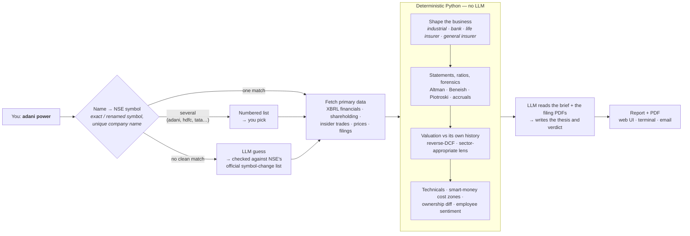
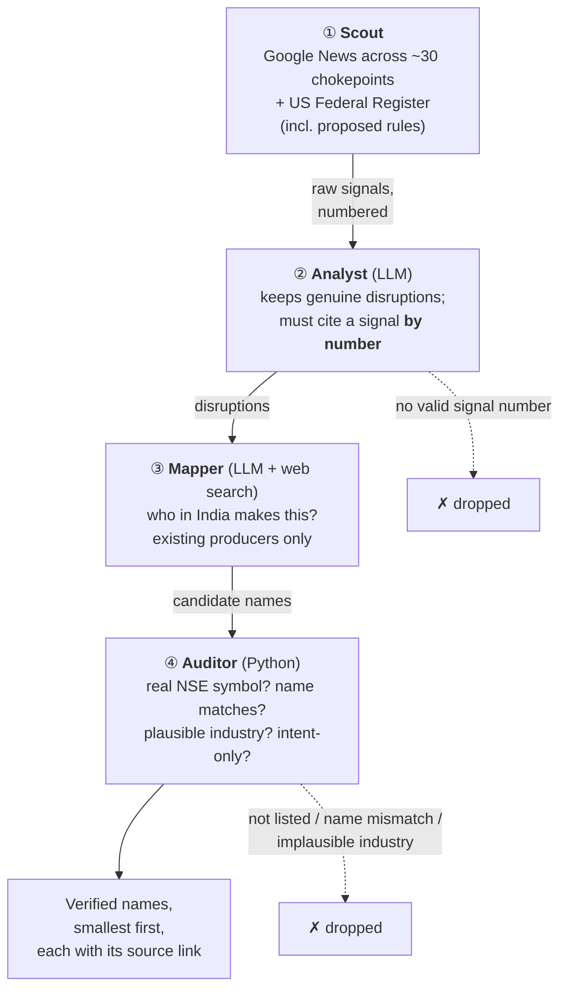
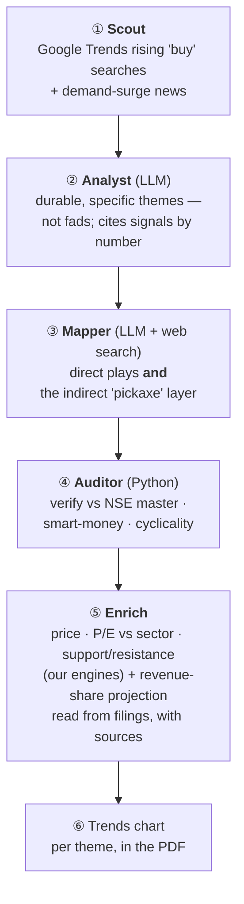
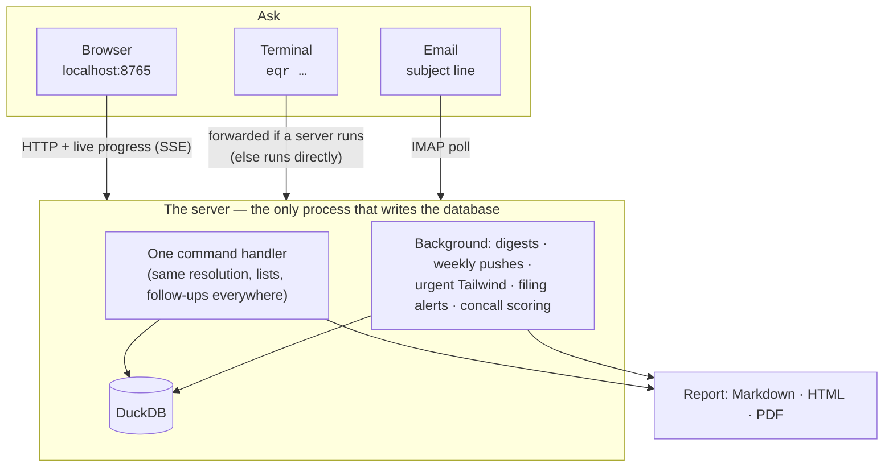

# 🧠 How it thinks

Most "AI stock analysts" ask a language model about a company and print what it says. This one works the
other way round: **Python computes every number from primary filings, and the model is only allowed to
read, triage and write — with every claim it makes checked against something real.** This page shows the
three places that matters most.

← back to the [README](../README.md) · every formula: [METHODOLOGY.md](METHODOLOGY.md) · every command: [COMMANDS.md](COMMANDS.md)

## 1. A deep report: numbers first, words last

- **The model never supplies a number.** The brief it reads is already computed; it explains, it doesn't
  calculate. With no LLM configured at all, the report still builds with every number — only the prose is missing.
- **Ambiguity is shown, not guessed.** "hdfc" is four listed companies, so you get a list. An early version
  guessed HDFC Bank; that was the first bug a real user hit.
- **The shape follows the business.** A bank has no EBITDA and an insurer has no working capital, so they get
  NIM / NPAs / CET1 and APE / persistency / combined ratio / solvency instead of a page of "n/a".

## 2. 💨 Tailwind — four agents, each checking the one before

A supply shock somewhere in the world (an export ban, a quota, a tariff) forces buyers to find another
supplier. Tailwind looks for the Indian listed companies that *are* that other supplier. Nobody types a
commodity — it scans roughly 30 chokepoints (metals, agri, pharma inputs, chemicals, fertiliser, energy)
and also takes open-ended news.

The guard-rails are the design:

- **The Analyst can't invent a source.** It returns the *number* of the signal that evidences each
  disruption; Python maps that number back to the URL it actually fetched. No valid number, no disruption.
- **The Auditor doesn't trust the Mapper.** Every name must resolve to a real NSE symbol whose company name
  matches, in an industry that could plausibly make the thing; "plans to", "MoU", "bid" are flagged as
  intent-only and ranked below real producers.
- **"n/a" and "nothing" are allowed answers.** Revenue share and market share are left blank when they
  aren't known, and a shock with no clean listed beneficiary says so rather than forcing a name.

## 3. ⛏️ Pickaxe — the same idea, on the demand side

In a gold rush, sell pickaxes. When demand for something surges in India, the obvious producers are
crowded and cyclical; the supplier of feed, vaccines, packaging or equipment to *them* often isn't.

Example from a live run: a pet-care demand theme mapped past the obvious poultry producer to an
animal-vaccine maker and an animal-API maker — the less cyclical "pickaxe" layer.

## 4. A real case, told straight

On **Saturday 19-Sep-2026** the weekly Tailwind digest carried a low-severity catalyst: the **Philippines
restricting exports of ube (purple yam)**. There is no "purple-yam stock", so the Mapper went one layer out
— natural colours and specialty food ingredients — and the Auditor kept three small-caps. What they did
next, from the exchange's own closing prices (Friday 18-Sep close = 0):

| Name | Mon 21 | **Tue 22** | Wed 23 | Mon 28 |
|---|---:|---:|---:|---:|
| AVT Natural Products (AVTNPL) | +5.1% | **+14.7%** | +13.0% | +1.1% |
| Vidhi Specialty Food Ingredients (VIDHIING) | +2.9% | +4.5% | +4.4% | +2.7% |
| Dynemic Products (DYNPRO) | 0.0% | +0.7% | +2.0% | −2.3% |
| *Nifty 50, for context* | | *−0.1%* | | *−2.4%* |

What this does and doesn't show:

- **One of three ran, and it gave most of it back within a week.** This is an idea generator, not a
  trading signal — every report says so, and a single case is an anecdote, not a backtest.
- **It found a name no screen would have** — a small colours-and-extracts company, reached from a food
  export ban on another continent, while the index was flat.
- **It was late, and that changed the code.** The mid-week "urgent" alert only fired for *high*-severity
  shocks, so this one waited for Saturday's digest. The urgent check now runs three times each trading day
  (08:30 / 12:30 / 18:00) and also breaks in for a fresh shock of **any severity that carries a small- or
  mid-cap beneficiary** — the kind that moves on news the market hasn't priced — while already-seen shocks
  are skipped before the expensive mapping step.

## 5. One process, three front doors

DuckDB allows one writer, so everything runs inside one process and the CLI forwards to it. That is also
why the three front doors behave identically: there is only one handler behind them.
